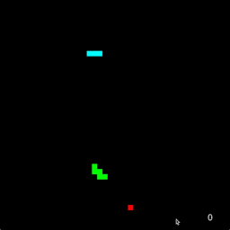

# Snake vs CPU 🐍


It’s Snake. But not just *any* snake. This is **Player vs. CPU Snake**, built with `pygame-ce`, where your squishy human reflexes go head-to-head with a cold, calculating AI serpent who does not know mercy. **More features to come!**

**Note:** The CPU snake is powered by a simple greedy algorithm. It moves fast, grows quickly, and can be outsmarted—if you survive long enough.

---

## Features

- Classic Snake gameplay with an AI twist  
- CPU-controlled snake that aggressively targets fruit  
- Real-time collision, fruit handling, and dynamic score tracking  
- Modular code structure using object-oriented Python  
- Built with `pygame-ce` for fast, frame-based game logic  

---

## Installation

Clone the repo and install the requirements:

```bash
git clone https://github.com/gurveershienh/snakevscpu.git
cd snakevscpu/src
```

Create a virtual environment:

```bash
python -m venv venv
source venv/bin/activate  # Windows: venv\Scripts\activate
```

Install dependencies:

```bash
pip install -r requirements.txt
```

> `pygame-ce` is included in the requirements.

---

## Usage

To start the game:

```bash
python main.py
```

Gameplay Overview:
- Blue snake: You 
- Green snake: Rival CPU 
- Red fruit: grow fast, win faster  

---

## Controls

- `W` / `↑` — Up  
- `A` / `←` — Left  
- `S` / `↓` — Down  
- `D` / `→` — Right  

Avoid walls, yourself, and your AI enemy.

---

## Greedy Snake AI

The CPU snake uses a basic **greedy pathfinding algorithm**. On each update cycle, it evaluates available directions and chooses the one that brings it closest to the fruit while avoiding collisions with:
- The board edges
- Its own body
- The player snake

It uses **squared Euclidean distance** for fast calculation and purely local heuristics—no full pathfinding, no memory. It’s hungry and reckless. You’ll love it or hate it.

---

## Final notes

- Fruit can spawn near snake bodies, to be fixed
- CPU snake occasionally self-sabotages (which is funny)
- Smart snake algorithms (A*, BFS) and timed game mode to come

---

Enjoy the chaos.